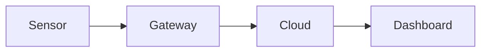

Everything on this page survives a save in the browser editor. The grey
boxes show what to type; the part below each one shows the result.

(writing-links)=

## Links

Link to another page with its file name, and to a heading on it with the
heading in lower case with dashes:

```text
[Editing these docs](editing-these-docs.md)
[Images section](editing-these-docs.md#images)
```

[Editing these docs](editing-these-docs.md) ·
[Images section](editing-these-docs.md#images)

### Linking to a paragraph

Put a label on its own line directly above any paragraph, list or box:

```text
(support-hours)=
Support is available Monday to Friday, 8:00 to 17:00.
```

(support-hours)=
Support is available Monday to Friday, 8:00 to 17:00.

Then link to it from any page. Unlike file names, labels keep working when
a page is renamed or moved into a folder:

```text
See {ref}`our support hours <support-hours>`.
```

See {ref}`our support hours <support-hours>`.

A label above a heading works the same way, and then the link text can be
left out: {ref}`writing-links`.

### Footnotes

```text
Exports are limited to 10,000 rows.[^limit]

[^limit]: Contact support for larger exports.
```

Exports are limited to 10,000 rows.[^limit]

[^limit]: Contact support for larger exports.

## Product names and UI elements

Write the product name as a substitution so it can be changed in one place
(`conf.py`), and mark buttons and keys:

```text
Open {{ product }}, click {guilabel}`Settings`, then press {kbd}`Ctrl+S`.
```

Open {{ product }}, click {guilabel}`Settings`, then press {kbd}`Ctrl+S`.

## Boxes

```text
:::{note}
Plain note. Also: tip, important, warning, danger, seealso.
:::

:::{admonition} Before you start
:class: tip

A box with its own title.
:::

:::{versionadded} 2.4
Bulk export.
:::
```

:::{note}
Plain note. Also: tip, important, warning, danger, seealso.
:::

:::{admonition} Before you start
:class: tip

A box with its own title.
:::

:::{versionadded} 2.4
Bulk export.
:::

## Collapsible sections and tabs

```text
:::{dropdown} Why is my sensor offline?
Check the power supply first.
:::

::::{tab-set}

:::{tab-item} Windows
Download the installer.
:::

:::{tab-item} macOS
Download the disk image.
:::

::::
```

:::{dropdown} Why is my sensor offline?
Check the power supply first.
:::

::::{tab-set}

:::{tab-item} Windows
Download the installer.
:::

:::{tab-item} macOS
Download the disk image.
:::

::::

## Figures

A figure has a caption and a name you can link to from any page:

```text
:::{figure} /images/example-dashboard.png
:name: fig-dashboard
:width: 360px

The dashboard after the first login.
:::

As {ref}`the dashboard figure <fig-dashboard>` shows, ...
```

:::{figure} /images/example-dashboard.png
:name: fig-dashboard
:width: 360px

The dashboard after the first login.
:::

As {ref}`the dashboard figure <fig-dashboard>` shows, the menu is at the top.

## Code

Code blocks get a copy button automatically. For a caption or highlighted
lines, insert a code block and set its language to `{code-block} json`
(instead of just `json`). The first lines inside it are the options,
followed by an empty line and the code:

```text
:caption: sensor.json
:emphasize-lines: 3
:linenos:
```

```{code-block} json
:caption: sensor.json
:emphasize-lines: 3
:linenos:

{
  "name": "Warehouse 1",
  "interval": 60,
  "alerts": true
}
```

Shell commands use the language `bash` (or `powershell`):

```bash
curl -O https://example.com/agent.sh
sh agent.sh --token YOUR_TOKEN
```

:::{warning}
Always use a real code block for code, never a `:::` box: text inside a
box is treated as normal text, so the editor turns URLs into links and
escapes characters like `_` and `*`.
:::

## Definitions and glossary

```text
Gateway
: The device that forwards sensor data to the cloud.

:::{glossary}
Sensor
  A device that measures a value, such as temperature.
:::

Every {term}`Sensor` belongs to one gateway.
```

Gateway
: The device that forwards sensor data to the cloud.

:::{glossary}
Sensor
  A device that measures a value, such as temperature.
:::

Every {term}`Sensor` belongs to one gateway.

## Diagrams

A code block with the language `mermaid` becomes a diagram:



## Tables

Use the editor's table button, or type one:


| Plan | Sensors | Support |
| ----- | ------- | ------- |
| Basic | 10 | Email |
| Pro | 100 | Phone |


## What the browser editor can't keep

- Task lists (`- [ ]`) lose their checkboxes.
- Raw HTML, including comments, is removed.
- Reference-style links are turned into normal links.

